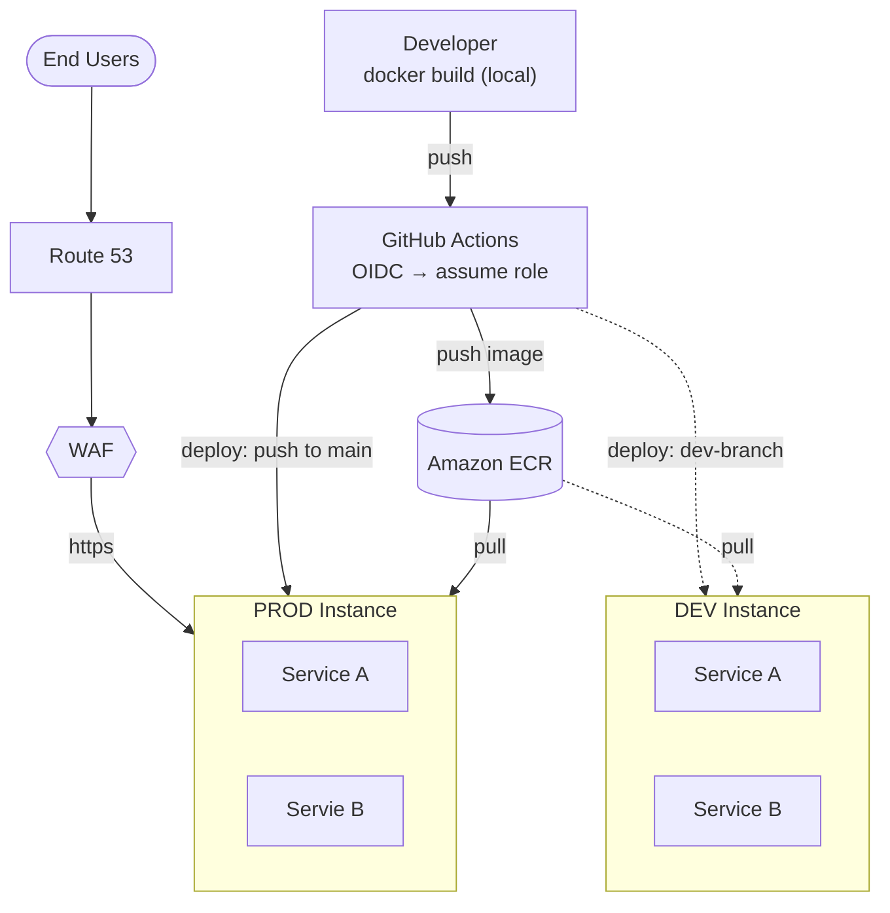

# GBT Backend Deployment Architecture

This is the high level deployment architecture for GBT backend services

## Deployment Architecture

## Deploy flow: commit to running container

1. Developer builds and tests the image locally (`docker build`) before pushing.
2. Code is pushed to `main`.
3. GitHub Actions triggers the `deploy-prod` workflow.
4. The workflow authenticates to AWS via **OIDC** — it assumes an IAM role for the duration of the run. No AWS access keys are stored in GitHub.
5. Using that role's temporary credentials, it logs Docker into ECR.
6. It builds (or re-tags) the image and pushes it to the relevant ECR repo, tagged with the git SHA and `latest`.
7. It calls `aws ssm send-command`, targeting the EC2 instance, with the deploy script as the payload.
8. That command is queued inside **Systems Manager** — it does not reach the instance directly.
9. The **SSM Agent** running on the EC2 instance polls SSM outbound (no inbound port open anywhere) and picks up the queued job on its next poll.
10. The agent runs the command as root: `cd /opt/app && docker compose pull && docker compose up -d`.
11. `docker compose pull` authenticates to ECR using the instance's own IAM role via the ECR credential helper — again, no static credentials anywhere.
12. `docker compose up -d` recreates only the containers whose image changed. Both containers run with `restart: unless-stopped`, so a crash restarts them without intervention.
13. The agent reports the exit code back to Systems Manager; the workflow reads it via `aws ssm get-command-invocation` to confirm success or failure.
14. The instance itself is never replaced — only its containers are — so the public IP and any in-flight connections to the other container are undisturbed by the deploy.

Dev and Production deployment follows the same steps.

## AWS services and why each is here

| Service | Why it's used |
|---|---|
| **EC2** | Runs both containers per environment via Docker Compose. Cheaper than Fargate at this scale, and the instance persists across deploys |
| **Amazon ECR** | Private registry for both images, tagged by git SHA so a bad deploy can be rolled back to a known-good tag. |
| **IAM roles** (EC2 instance role + GitHub OIDC role) | Removes static AWS credentials from both the instance and the CI pipeline entirely. |
| **AWS Systems Manager (SSM)** | The deploy transport. The agent polls outbound for work — no SSH port, no key rotation, no inbound attack surface beyond the app itself. |
| **Route 53** | DNS for prod's public endpoint. |
| **AWS WAF** *(optional — flagged)* | Flat monthly cost regardless of traffic. Kept as an explicit decision point given the budget at this traffic scale, not assumed as required. |

## Why not Lambda

- **Cold starts hurt user experience** in a web app — a request landing on a cold function pays a latency penalty a user directly feels, which a persistently running container doesn't have.
- **Can't test locally** in a way that matches production — you end up mocking the Lambda runtime and API Gateway event shape, or testing against a real cloud environment just to know your code works. A Docker container runs identically on a laptop and in prod.
- **Hard 15-minute execution limit** — a real ceiling for any longer-running job, and one more constraint to design around for no benefit at this scale.
- Containers are just easier to work with day to day: build once, run the same artifact everywhere, no framework-specific packaging step.

## Why not Fargate

- **Cost doesn't scale down gracefully.** Two services × two environments as separate Fargate tasks runs close to $18/month in compute alone for prod tasks at minimum size — before public IPs or a load balancer — which already strains a £20/month total budget. EC2 comes in cheaper per unit of compute at this scale because Fargate carries a real premium for not managing the underlying instance.
- **Public IP instability.** A Fargate task is replaced on every deploy, so its public IP changes each time — a problem for anything pointing DNS directly at it. Fixing that properly needs either an Application Load Balancer (a further ~$16/month fixed cost) or a VPC Link + Cloud Map setup. An EC2 instance isn't replaced on deploy — only its containers are — so the public IP is stable without any of that extra plumbing.
- Given the budget target, EC2 avoids paying for both the Fargate premium and the infrastructure needed to work around Fargate's own IP-churn problem.

## Why EC2

- Cheapest compute option per vCPU/GB at this traffic level — confirmed against actual on-demand pricing for both paths.
- Docker Compose is genuinely simple here: build locally, push the image, pull and restart on the instance — no task definitions, clusters, or load balancer config to maintain.
- The instance's public IP survives every deploy, since deploying only touches the containers, not the instance.
- Self-healing is free: `restart: unless-stopped` on both containers, with an optional Auto Scaling Group (min=max=desired=1) for instance-level recovery at no extra AWS cost.